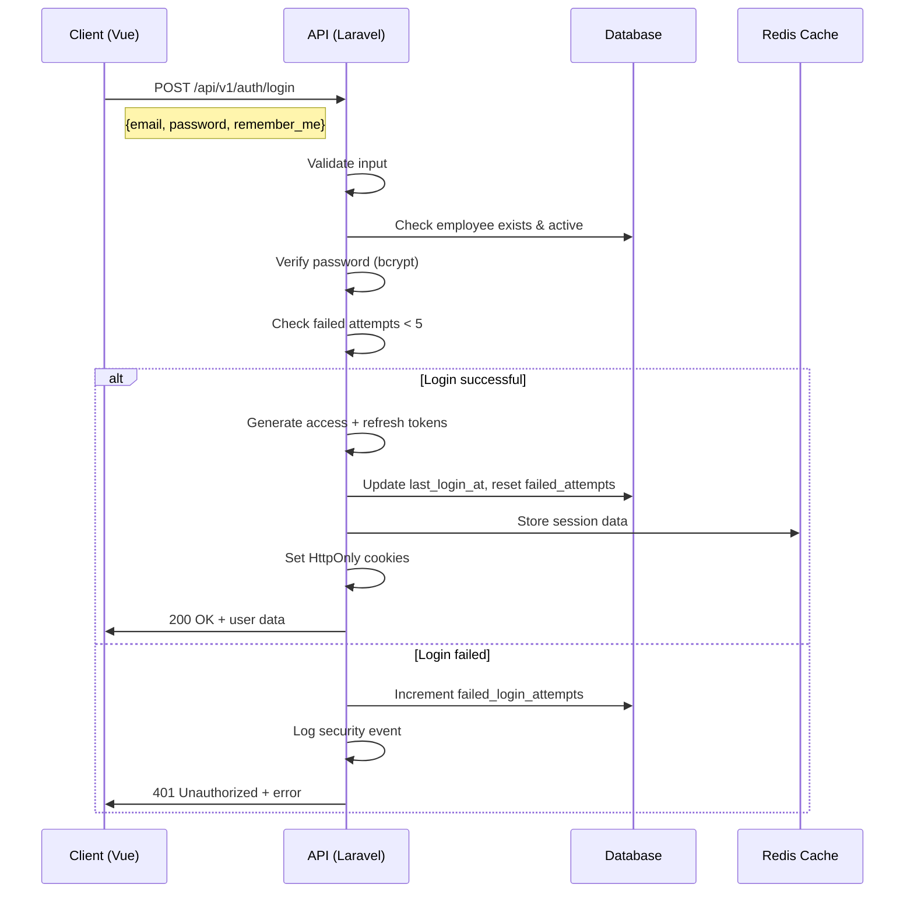
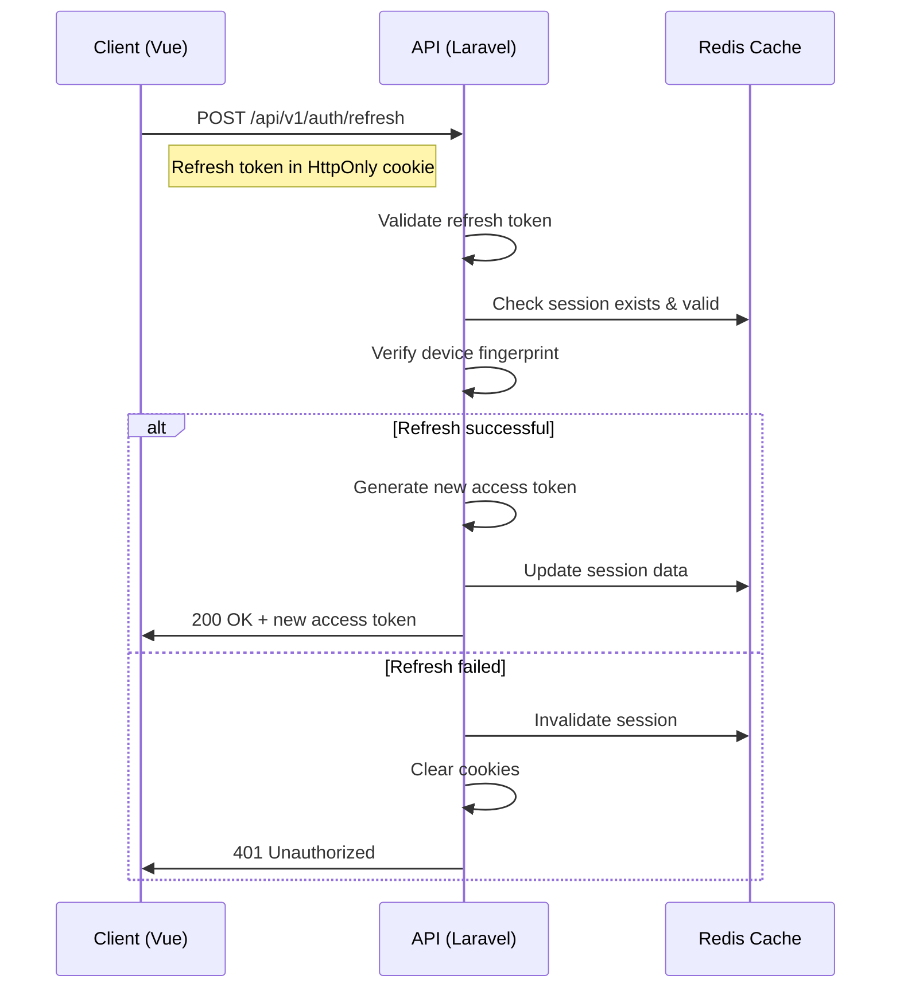
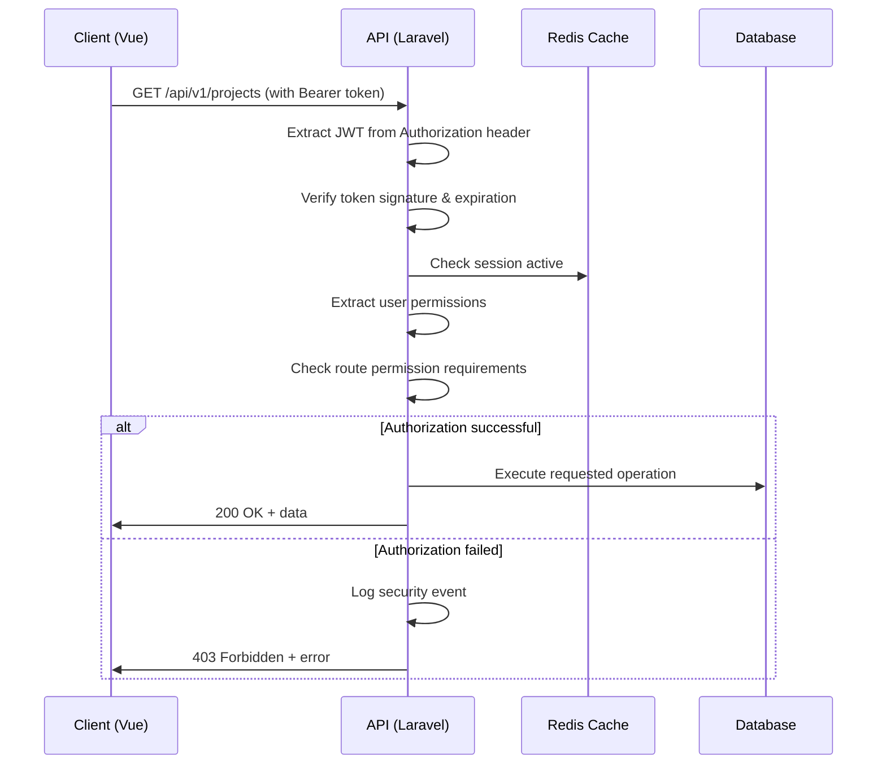

# Authentication System Architecture
## Employee Login System with JWT and Role-Based Access Control

### Overview
This document defines the complete authentication system architecture for the Employee Login System. The design implements JWT-based authentication with Laravel Sanctum, comprehensive role-based access control (RBAC), and enterprise-grade security measures.

## System Architecture

```
┌─────────────────────────────────────────────────────────────────────────────────┐
│                          CLIENT (Vue 3 Frontend)                                │
├─────────────────────────────────────────────────────────────────────────────────┤
│  ┌─────────────────┐  ┌─────────────────┐  ┌─────────────────┐                 │
│  │   LoginForm     │  │  AuthGuard      │  │  TokenManager   │                 │
│  │   Component     │  │  Router Guard   │  │  (Pinia Store)  │                 │
│  └─────────────────┘  └─────────────────┘  └─────────────────┘                 │
└─────────────────────────────────────────────────────────────────────────────────┘
                                    │
                               HTTPS + JSON
                                    │
┌─────────────────────────────────────────────────────────────────────────────────┐
│                          SERVER (Laravel Backend)                               │
├─────────────────────────────────────────────────────────────────────────────────┤
│  ┌─────────────────┐  ┌─────────────────┐  ┌─────────────────┐                 │
│  │  AuthController │  │  Sanctum        │  │  Role           │                 │
│  │  API Endpoints  │  │  Middleware     │  │  Middleware     │                 │
│  └─────────────────┘  └─────────────────┘  └─────────────────┘                 │
│                                    │                                            │
│  ┌─────────────────┐  ┌─────────────────┐  ┌─────────────────┐                 │
│  │  AuthService    │  │  Password       │  │  Audit          │                 │
│  │  Business Logic │  │  Reset Service  │  │  Logger         │                 │
│  └─────────────────┘  └─────────────────┘  └─────────────────┘                 │
└─────────────────────────────────────────────────────────────────────────────────┘
                                    │
┌─────────────────────────────────────────────────────────────────────────────────┐
│                          DATABASE (MySQL)                                       │
├─────────────────────────────────────────────────────────────────────────────────┤
│  ┌─────────────────┐  ┌─────────────────┐  ┌─────────────────┐                 │
│  │   employees     │  │ password_resets │  │   audit_log     │                 │
│  │     table       │  │     table       │  │     table       │                 │
│  └─────────────────┘  └─────────────────┘  └─────────────────┘                 │
└─────────────────────────────────────────────────────────────────────────────────┘
```

## JWT Token Structure

### Access Token Payload
```json
{
  "iss": "unified-contractors.com",
  "sub": "employee-123",
  "aud": "uc-frontend",
  "exp": 1703876400,
  "iat": 1703875500,
  "nbf": 1703875500,
  "jti": "unique-jwt-id",
  "employee_id": 123,
  "email": "employee@unifiedcontractors.com",
  "role": "project_manager",
  "permissions": [
    "projects.read",
    "projects.create",
    "projects.update",
    "files.upload",
    "files.delete"
  ],
  "session_id": "sess_abc123def456",
  "ip_address": "192.168.1.100",
  "user_agent": "Mozilla/5.0..."
}
```

### Refresh Token Payload
```json
{
  "iss": "unified-contractors.com",
  "sub": "employee-123",
  "aud": "uc-refresh",
  "exp": 1704480300,
  "iat": 1703875500,
  "type": "refresh",
  "session_id": "sess_abc123def456",
  "fingerprint": "sha256_device_fingerprint"
}
```

### Token Configuration
- **Access Token Expiration**: 15 minutes
- **Refresh Token Expiration**: 7 days
- **Algorithm**: HS256 (HMAC with SHA-256)
- **Secret Rotation**: Monthly (automated)
- **Token Storage**: HttpOnly Secure Cookies

## Role-Based Access Control (RBAC)

### Role Hierarchy
```
super_admin (Level 4)
    │
    ├── Full system access
    ├── Employee management
    ├── System configuration
    └── Audit log access
    
admin (Level 3)
    │
    ├── Project management
    ├── Employee project assignment
    ├── Client feedback management
    └── File management
    
project_manager (Level 2)
    │
    ├── Assigned project management
    ├── Team coordination
    ├── File upload/organization
    └── Client communication
    
employee (Level 1)
    │
    ├── Assigned project access
    ├── File upload
    ├── Basic project updates
    └── Own profile management
```

### Permission Matrix

| Permission | employee | project_manager | admin | super_admin |
|------------|----------|----------------|--------|-------------|
| **Authentication** |
| auth.login | ✓ | ✓ | ✓ | ✓ |
| auth.logout | ✓ | ✓ | ✓ | ✓ |
| auth.refresh | ✓ | ✓ | ✓ | ✓ |
| auth.reset_password | ✓ | ✓ | ✓ | ✓ |
| **Profile Management** |
| profile.read | ✓ (own) | ✓ (own) | ✓ (own) | ✓ (all) |
| profile.update | ✓ (own) | ✓ (own) | ✓ (own) | ✓ (all) |
| **Projects** |
| projects.read | ✓ (assigned) | ✓ (assigned) | ✓ (all) | ✓ (all) |
| projects.create | ✗ | ✓ | ✓ | ✓ |
| projects.update | ✗ | ✓ (assigned) | ✓ (all) | ✓ (all) |
| projects.delete | ✗ | ✗ | ✓ | ✓ |
| projects.assign | ✗ | ✗ | ✓ | ✓ |
| **Files** |
| files.upload | ✓ (assigned) | ✓ (assigned) | ✓ (all) | ✓ (all) |
| files.download | ✓ (assigned) | ✓ (assigned) | ✓ (all) | ✓ (all) |
| files.delete | ✗ | ✓ (assigned) | ✓ (all) | ✓ (all) |
| files.manage | ✗ | ✓ (assigned) | ✓ (all) | ✓ (all) |
| **QR Codes** |
| qr.generate | ✗ | ✓ (assigned) | ✓ (all) | ✓ (all) |
| qr.regenerate | ✗ | ✓ (assigned) | ✓ (all) | ✓ (all) |
| qr.disable | ✗ | ✗ | ✓ | ✓ |
| **Feedback** |
| feedback.read | ✓ (assigned) | ✓ (assigned) | ✓ (all) | ✓ (all) |
| feedback.update | ✗ | ✓ (assigned) | ✓ (all) | ✓ (all) |
| feedback.resolve | ✗ | ✓ (assigned) | ✓ (all) | ✓ (all) |
| **Administration** |
| admin.users | ✗ | ✗ | ✓ | ✓ |
| admin.system | ✗ | ✗ | ✗ | ✓ |
| admin.audit | ✗ | ✗ | ✓ | ✓ |

## Authentication Flow

### 1. Login Process


### 2. Token Refresh Process


### 3. Protected Route Access


## Security Implementation

### Password Security
```php
// Password Hashing Configuration
'password' => [
    'driver' => 'bcrypt',
    'rounds' => 12,
    'verify_cost' => true,
    'time_limit' => 2, // seconds
]

// Password Validation Rules
'password' => [
    'required',
    'string',
    'min:8',
    'max:128',
    'regex:/^(?=.*[a-z])(?=.*[A-Z])(?=.*\d)(?=.*[@$!%*?&])[A-Za-z\d@$!%*?&]/',
    'confirmed',
    'not_pwned:1000' // HaveIBeenPwned integration
]
```

### Account Security Features

#### 1. Account Lockout Protection
```php
// Lockout Configuration
const MAX_FAILED_ATTEMPTS = 5;
const LOCKOUT_DURATION = 30; // minutes
const LOCKOUT_DECAY = 60; // minutes

// Progressive Delays
$delays = [
    1 => 0,      // First attempt
    2 => 2,      // 2 seconds
    3 => 5,      // 5 seconds
    4 => 15,     // 15 seconds
    5 => 60,     // 1 minute (then lockout)
];
```

#### 2. Session Security
```php
// Session Configuration
'session' => [
    'lifetime' => 15, // minutes
    'expire_on_close' => false,
    'encrypt' => true,
    'secure' => true,
    'same_site' => 'strict',
    'http_only' => true,
    'path' => '/',
    'domain' => '.unifiedcontractors.com'
]
```

#### 3. Device Fingerprinting
```javascript
// Client-side fingerprint generation
const generateFingerprint = () => {
    const canvas = document.createElement('canvas');
    const ctx = canvas.getContext('2d');
    ctx.textBaseline = 'top';
    ctx.font = '14px Arial';
    ctx.fillText('Device fingerprint', 2, 2);
    
    const fingerprint = {
        screen: `${screen.width}x${screen.height}`,
        timezone: Intl.DateTimeFormat().resolvedOptions().timeZone,
        language: navigator.language,
        platform: navigator.platform,
        canvas: canvas.toDataURL(),
        userAgent: navigator.userAgent.slice(0, 200)
    };
    
    return btoa(JSON.stringify(fingerprint));
};
```

### Security Middleware Stack

#### 1. CORS Configuration
```php
// config/cors.php
'allowed_origins' => [
    'https://unifiedcontractors.com',
    'https://www.unifiedcontractors.com',
    env('APP_ENV') === 'local' ? 'http://localhost:5173' : null
],
'allowed_methods' => ['GET', 'POST', 'PUT', 'PATCH', 'DELETE', 'OPTIONS'],
'allowed_headers' => ['*'],
'exposed_headers' => [],
'max_age' => 86400,
'supports_credentials' => true,
```

#### 2. Rate Limiting
```php
// Rate limiting rules
'api' => [
    'auth.login' => '5:1', // 5 attempts per minute
    'auth.refresh' => '10:1', // 10 refreshes per minute
    'auth.forgot-password' => '3:5', // 3 attempts per 5 minutes
    'auth.reset-password' => '2:10', // 2 resets per 10 minutes
    'default' => '60:1', // 60 requests per minute
]
```

#### 3. Security Headers
```php
// Security headers middleware
$response->headers->set('X-Content-Type-Options', 'nosniff');
$response->headers->set('X-Frame-Options', 'DENY');
$response->headers->set('X-XSS-Protection', '1; mode=block');
$response->headers->set('Strict-Transport-Security', 'max-age=31536000; includeSubDomains');
$response->headers->set('Content-Security-Policy', 
    "default-src 'self'; " .
    "script-src 'self' 'unsafe-inline'; " .
    "style-src 'self' 'unsafe-inline'; " .
    "img-src 'self' data: https:; " .
    "connect-src 'self' https://api.unifiedcontractors.com"
);
```

## API Endpoint Specifications

### Authentication Endpoints

#### POST /api/v1/auth/login
```json
// Request
{
    "email": "employee@unifiedcontractors.com",
    "password": "SecurePassword123!",
    "remember_me": true,
    "device_fingerprint": "base64_encoded_fingerprint"
}

// Success Response (200 OK)
{
    "success": true,
    "message": "Login successful",
    "data": {
        "employee": {
            "id": 123,
            "email": "employee@unifiedcontractors.com",
            "first_name": "John",
            "last_name": "Doe",
            "role": "project_manager",
            "permissions": ["projects.read", "projects.create", "files.upload"]
        },
        "access_token": "eyJ0eXAiOiJKV1QiLCJhbGciOiJIUzI1NiJ9...",
        "expires_in": 900,
        "token_type": "Bearer"
    }
}

// Error Response (401 Unauthorized)
{
    "success": false,
    "message": "Invalid credentials",
    "errors": {
        "email": ["The provided credentials are invalid."]
    },
    "remaining_attempts": 3
}
```

#### POST /api/v1/auth/refresh
```json
// Request (refresh token in HttpOnly cookie)
{}

// Success Response (200 OK)
{
    "success": true,
    "message": "Token refreshed successfully",
    "data": {
        "access_token": "eyJ0eXAiOiJKV1QiLCJhbGciOiJIUzI1NiJ9...",
        "expires_in": 900,
        "token_type": "Bearer"
    }
}
```

#### POST /api/v1/auth/logout
```json
// Request
{
    "logout_all_devices": false
}

// Success Response (200 OK)
{
    "success": true,
    "message": "Logged out successfully"
}
```

#### POST /api/v1/auth/forgot-password
```json
// Request
{
    "email": "employee@unifiedcontractors.com"
}

// Success Response (200 OK)
{
    "success": true,
    "message": "Password reset link sent to your email"
}
```

#### POST /api/v1/auth/reset-password
```json
// Request
{
    "email": "employee@unifiedcontractors.com",
    "token": "reset_token_from_email",
    "password": "NewSecurePassword123!",
    "password_confirmation": "NewSecurePassword123!"
}

// Success Response (200 OK)
{
    "success": true,
    "message": "Password reset successfully"
}
```

## Frontend Integration

### Pinia Auth Store
```javascript
// stores/auth.js
import { defineStore } from 'pinia';
import { authApi } from '@/services/auth-api';

export const useAuthStore = defineStore('auth', {
    state: () => ({
        employee: null,
        isAuthenticated: false,
        permissions: [],
        loading: false,
        error: null,
        accessToken: null,
        tokenExpiry: null
    }),
    
    getters: {
        hasPermission: (state) => (permission) => {
            return state.permissions.includes(permission);
        },
        
        hasRole: (state) => (role) => {
            return state.employee?.role === role;
        },
        
        hasAnyRole: (state) => (roles) => {
            return roles.includes(state.employee?.role);
        },
        
        isTokenExpired: (state) => {
            if (!state.tokenExpiry) return true;
            return Date.now() >= state.tokenExpiry;
        }
    },
    
    actions: {
        async login(credentials) {
            this.loading = true;
            this.error = null;
            
            try {
                const response = await authApi.login(credentials);
                this.setAuthData(response.data);
                this.startTokenRefreshTimer();
                return response;
            } catch (error) {
                this.error = error.response?.data?.message || 'Login failed';
                throw error;
            } finally {
                this.loading = false;
            }
        },
        
        async refreshToken() {
            try {
                const response = await authApi.refresh();
                this.accessToken = response.data.access_token;
                this.tokenExpiry = Date.now() + (response.data.expires_in * 1000);
                this.startTokenRefreshTimer();
                return response;
            } catch (error) {
                this.logout();
                throw error;
            }
        },
        
        async logout() {
            try {
                await authApi.logout();
            } catch (error) {
                console.error('Logout error:', error);
            } finally {
                this.clearAuthData();
            }
        },
        
        setAuthData(data) {
            this.employee = data.employee;
            this.isAuthenticated = true;
            this.permissions = data.employee.permissions;
            this.accessToken = data.access_token;
            this.tokenExpiry = Date.now() + (data.expires_in * 1000);
        },
        
        clearAuthData() {
            this.employee = null;
            this.isAuthenticated = false;
            this.permissions = [];
            this.accessToken = null;
            this.tokenExpiry = null;
            this.clearTokenRefreshTimer();
        },
        
        startTokenRefreshTimer() {
            this.clearTokenRefreshTimer();
            
            // Refresh token 2 minutes before expiry
            const refreshTime = (this.tokenExpiry - Date.now()) - 120000;
            
            if (refreshTime > 0) {
                this.refreshTimer = setTimeout(() => {
                    this.refreshToken();
                }, refreshTime);
            }
        },
        
        clearTokenRefreshTimer() {
            if (this.refreshTimer) {
                clearTimeout(this.refreshTimer);
                this.refreshTimer = null;
            }
        }
    }
});
```

### Route Guards
```javascript
// router/guards.js
import { useAuthStore } from '@/stores/auth';

export const authGuard = (to, from, next) => {
    const authStore = useAuthStore();
    
    if (to.meta.requiresAuth && !authStore.isAuthenticated) {
        next({ name: 'employee-login', query: { redirect: to.fullPath } });
        return;
    }
    
    if (to.meta.roles && !authStore.hasAnyRole(to.meta.roles)) {
        next({ name: 'not-authorized' });
        return;
    }
    
    if (to.meta.permissions) {
        const hasPermission = to.meta.permissions.some(permission => 
            authStore.hasPermission(permission)
        );
        
        if (!hasPermission) {
            next({ name: 'not-authorized' });
            return;
        }
    }
    
    next();
};
```

## Security Monitoring

### Audit Logging
```php
// Security event logging
class SecurityEventLogger 
{
    const EVENTS = [
        'LOGIN_SUCCESS' => 'login_success',
        'LOGIN_FAILED' => 'login_failed', 
        'ACCOUNT_LOCKED' => 'account_locked',
        'PASSWORD_RESET' => 'password_reset',
        'TOKEN_REFRESH' => 'token_refresh',
        'UNAUTHORIZED_ACCESS' => 'unauthorized_access',
        'SUSPICIOUS_ACTIVITY' => 'suspicious_activity'
    ];
    
    public function log(string $event, array $data = [])
    {
        Log::channel('security')->info($event, [
            'employee_id' => $data['employee_id'] ?? null,
            'ip_address' => request()->ip(),
            'user_agent' => request()->userAgent(),
            'timestamp' => now(),
            'session_id' => session()->getId(),
            'additional_data' => $data
        ]);
    }
}
```

### Alerting System
```php
// Security alert configuration
'security_alerts' => [
    'failed_login_threshold' => 10, // Alert after 10 failed attempts
    'suspicious_ip_threshold' => 5, // Alert for IPs with 5+ failures
    'account_lockout_alert' => true,
    'multiple_login_alert' => true, // Same account, different IPs
    'off_hours_login_alert' => true, // Login outside business hours
]
```

## Implementation Checklist

### Phase 1: Core Authentication
- [ ] Database tables and relationships
- [ ] Laravel Sanctum configuration
- [ ] Employee model with authentication
- [ ] JWT token generation and validation
- [ ] Password hashing and verification
- [ ] Account lockout protection

### Phase 2: API Endpoints
- [ ] Login/logout endpoints
- [ ] Token refresh endpoint
- [ ] Password reset flow
- [ ] User profile endpoints
- [ ] Input validation and sanitization
- [ ] Rate limiting implementation

### Phase 3: Frontend Integration
- [ ] Pinia auth store
- [ ] API client configuration
- [ ] Route guards and navigation
- [ ] Login/logout components
- [ ] Token management
- [ ] Error handling and user feedback

### Phase 4: Security Hardening
- [ ] CORS configuration
- [ ] Security headers
- [ ] CSRF protection
- [ ] Device fingerprinting
- [ ] Audit logging
- [ ] Security monitoring

### Phase 5: Testing and Validation
- [ ] Unit tests for auth services
- [ ] Integration tests for API endpoints
- [ ] Frontend component tests
- [ ] Security penetration testing
- [ ] Performance testing
- [ ] User acceptance testing

## Compliance and Standards

### Security Standards
- **OWASP Top 10 2021**: Full compliance
- **NIST Cybersecurity Framework**: Implementation
- **ISO 27001**: Security management alignment
- **PCI DSS**: Data protection standards

### Privacy Compliance
- **Data Minimization**: Only collect necessary data
- **Purpose Limitation**: Use data only for intended purposes
- **Storage Limitation**: Automatic data cleanup and archival
- **Transparency**: Clear privacy policy and data handling